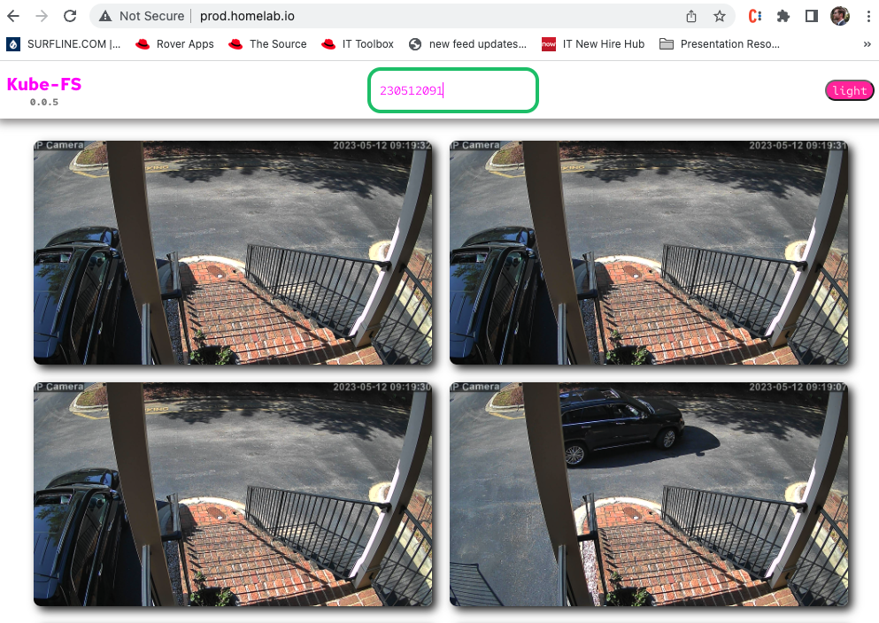

# Kubefs

KubeFS is a file system controller sitting on top of Kubernetes. It binds volumes of FTP files into pods enabling the user to quickly filter, delete, and manage said files. The frontend is setup to handle photos captured by IP Cameras, it can filter down to a given second, delete large groups of files simultaneously, and change color themes. KubeFS is cloud native and built to run in Kubernetes but can run on a linux VM outside of Kubernetes.

- [Original Use case](#original-use-case)
- [CLI](#cli)
- [Functionalities](#functionalities)
- [Usage](#usage)
- [Contribute](CONTRIBUTING.md#label-commits)
- [Build](#build)
- [API](#api)

## Original Use Case

Depending on the IP Camera and the sensitivity level, the motion detection alarm can generate a lot irrelevent captures, making it difficult to identify the false positives from the true positives.

This project is built to manage images generated from motion detection alarm of an IP-Camera(s).

## CLI

- Serve - serves the webserver
- port - port from which to serve
- cert - server certificate
- key - server private key
- dir - image directory

**_example_**:

```bash
openssl req -x509 -nodes -days 365 -newkey rsa:2048 -keyout cert.key -out cert.crt -subj "/CN=kubefs.earth.milkyway/O=kubefs.earth.milkyway"


go run cmd/kubefs/*.go serve -p 8443 --cert cert.crt --key cert.key --dir /tmp
```

**_output_**:
```bash
Starting server at 8443 watching directory /tmp.
```

**_check server cert_**:  
while running the webserver in another terminal...
```bash
openssl s_client -showcerts -connect localhost:8443 | egrep "subject=CN"
```

**_output_**:
```bash
depth=0 CN = kubefs.earth.milkyway, O = kubefs.earth.milkyway
verify error:num=18:self-signed certificate
verify return:1
depth=0 CN = kubefs.earth.milkyway, O = kubefs.earth.milkyway
verify return:1
subject=CN = kubefs.earth.milkyway, O = kubefs.earth.milkyway
```


## Functionalities

* Deletion logic
    * Delete images more than X days old
    * Delete images captured between Date/Time and Date/Time
    * Retain max size of X in directory 
      * delete oldest first
    * Retain X number of files
      * delete oldest first
* View Logic
  * View images by day
  * View images by day and time
  * View files by camera
  * View files by camera, day, and time
  * View files from given camera on given date
* Backup Logic
  * Backup files for X days, then delete

## Components

* Frontend (React) 
* Backend (Go 1.19)
  * CLI

## Build

```bash
GOARCH=arm64 GOOS=linux go build -o kubefs ./cmd/kubefs
mv kubefs build/kubefs

docker build -t cmwylie19/kubefs:0.0.1 build/
docker push cmwylie19/kubefs:0.0.1
```


## API

*Cascade Delete*
```
k run curler --image=nginx --rm -i -- curl -sS 'kubefs.kubefs.svc.cluster.local:8080/delete/cascade?begin=A22102313094310.jpg&end=A22102313153810.jpg'


curl -sS 'http://192.168.1.209:30099/delete/cascade?begin=A22102900000000.jpg&end=A22102903000000.jpg'
```


*List Files*
```
k run curler --image=nginx --rm -i -- curl kubefs.kubefs.svc.cluster.local:8080/list
```

*Health Check*
```
k run curler --image=nginx --rm -i -- curl kubefs.kubefs.svc.cluster.local:8080/healthz
```